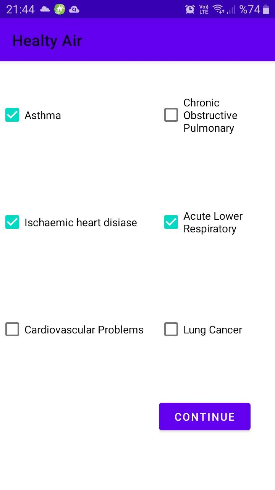

# HealthyAirApplication

This application is a prototype and has couple open issues.

Main purpose of the app is to inform the elder users about air healthyness in their current location with taking into consideration their diseases and some gas' s amounts in the air.

The application activities and functions are followings :

MainActivity-> Taking users' diseases selections as input.

NameActivity-> Taking users' names, surnames as input.

BluetoothActivity-> Asks users to open their mobile device' s bluetooth services (if not opened)
Connects to ardunio via Bluetooth and retrieves air gas measurements data from it.(5 measurements)

MapActivity-> Asks users to enable their mobile device's location services (if  disabled).
Sends URL request to specified web service. Example request => ("https://firla-277516.ey.r.appspot.com/?meas1=15&meas2=14&meas3=45&meas4=30&meas5=25&dis1=1&dis2=0&dis3=1&dis4=0&dis5=1&dis6=0")
Get response from wen service in json format. Example response => ("{"harmful":"[1]"}"). Example response => ("{"harmful":"[0]"}")
Web service using machine learning model predict result for inputs which are sent by http get method. (5 measurements in key['meas1']..key['meas5'], 6 disease info 0 or 1 in key['dis1']...key['dis6'])

Notify users to inform them about result if result is 1 than "This place is harmful" else "This place is safe"

Web service details:
->Running on google cloud platform.
->Using python flask framework.
->Inclued python module which used for train the machine learning model.

Machine learning model details:
->The model uses K-Nearest Neighbor algorithm to train and test model.
->Python scikit-learn library is used for this purpose.
->Training data (.csv) is prepared dummy which includes about 12000 rows and 12 columns in each row(11 input and 1 label).

